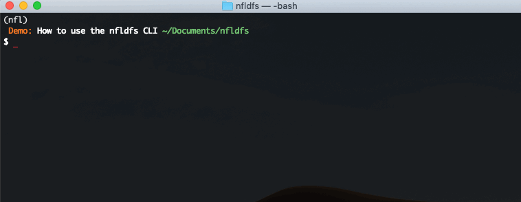

# nfldfs

[](https://codecov.io/gh/BrianDoucet01/nfldfs)

[](https://opensource.org/licenses/MIT)
[](http://hits.dwyl.com/BrianDoucet01/daily-fantasy-sports)
[](https://github.com/dwyl/esta/issues)


`nfldfs` is a Python package for NFL daily fantasy sports analysis. It provides an easy interface to scrape data for DraftKings, FanDuel, and Yahoo! from [rotoguru1](http://rotoguru.net) so that you don't have to.

* [Features](https://github.com/BrianDoucet01/daily-fantasy-sports#features)
* [Installation](https://github.com/BrianDoucet01/daily-fantasy-sports#installation)
* [Usage](https://github.com/BrianDoucet01/daily-fantasy-sports#usage)
  * [Work with it interactively](https://github.com/BrianDoucet01/daily-fantasy-sports#working-with-the-package-interactively)
  * [Use the CLI tool](https://github.com/BrianDoucet01/daily-fantasy-sports#using-the-cli)
* [Future Work](https://github.com/BrianDoucet01/daily-fantasy-sports#future-work)


## Features

+ Search for data using combinations of season and week
+ Return data only for the daily fantasy sites you care about
+ Work with results as a pandas DataFrame or use the CLI to output results directly to a `.csv`


## Installation
`nfldfs` is supported for Python 3 can be installed via pip:
```bash
pip install nfldfs
```
or from the repo (which may at times be more up-to-date):

```bash
# Clone the repo
git clone https://github.com/BrianDoucet01/nfldfs.git
cd nfldfs
python setup.py install
```
## Usage

If you're just looking for a bulk data download, it's recommended that you use the [CLI](https://github.com/BrianDoucet01/daily-fantasy-sports#using-the-cli) tool. It exports results directly to the `nfldfs/data` directory in `.csv` format. Head over there to see a [sample](https://github.com/BrianDoucet01/daily-fantasy-sports/tree/master/data) of DraftKings salary and points data for the entire 2017 season.

Here are some quick and dirty examples that illustrate how to work with the package interactively. For more robust examples and a data dictionary, refer to the [docs](https://github.com/BrianDoucet01/daily-fantasy-sports/tree/master/docs) folder.

### Working with the package interactively
Several examples to show how you could work with the package directly in [IPython](https://ipython.org/) or a [Jupyter Notebook](https://jupyter.org/).

**Get DraftKings salary and points data for the entire 2019 season.**

```Python
from nfldfs import games as games

# Scrape DraftKings salary and points data for the entire 2019 season
g = games.find_games('dk', 2019, 1, 2019, 17)
stats = games.get_game_data(g)

type(stats)
pandas.core.frame.DataFrame

# Confirm there's data for weeks 1-17
stats.week.unique()
array([ 1,  2,  3,  4,  5,  6,  7,  8,  9, 10, 11, 12, 13, 14, 15, 16, 17])

# Inspect a random sample of 10 rows
stats.sample(10)

       week year      player_name       position team_name home_or_away  \
gid                                                                    
5588    16  2019      Penny, Elijhaa       RB       nyg            a   
5765    11  2019    Spencer, Diontae       WR       den            a   
5556     3  2019      Samuel, Curtis       WR       car            a   
5790    17  2019    Blake, Christian       WR       atl            a   
5649    16  2019      Foster, Robert       WR       buf            a   
7031    12  2019          Washington      Def       was            h   
4675    14  2019       Henry, Hunter       TE       lac            a   
1403     3  2019        Dalton, Andy       QB       cin            a   
5386     3  2019      Lockett, Tyler       WR       sea            h   
1519     7  2019  Trubisky, Mitchell       QB       chi            h  

      opponent_name  points  salary dfs_site  
gid                                          
5588           was    0.00  3000.0       dk  
5765           min    0.00  3000.0       dk  
5556           ari   16.30  4800.0       dk  
5790           tam    0.00  3000.0       dk  
5649           nwe    0.00  3000.0       dk  
7031           det   21.00  3000.0       dk  
4675           jac   11.90  5100.0       dk  
1403           buf   18.06  5300.0       dk  
5386           nor   35.40  6200.0       dk  
1519           nor   20.04  5100.0       dk  
```


**Get data for DraftKings, FanDuel, and Yahoo! for week 2 of the 2018 season.**

```python
# Get Yahoo! data for a single week aross multiple seasons
yh = games.find_games(dfs_site='yh',
                     season_from=2018,
                     week_from=1,
                     season_to=2019)
                     week  year    player_name position team_name home_or_away  \
          year gid                                                               
          2018 7030     1  2018      Tennessee      Def       ten            a   
               1225     1  2018   Manning, Eli       QB       nyg            h   
          2019 1539     1  2019  Jones, Daniel       QB       nyg            a   
               5424     1  2019  Diggs, Stefon       WR       min            h   

                    opponent_name  points  salary dfs_site  
          year gid                                          
          2018 7030           mia   11.00    12.0       yh  
               1225           jac    8.16    23.0       yh  
          2019 1539           dal   -0.82    20.0       yh  
               5424           atl    4.70    25.0       yh  
```

### Using the CLI
The command line interface (CLI) was designed for those who just want to download the raw data to use elsewhere; be it a database, Excel, Google Sheets, or another program.

You run the CLI tool by calling it directly from within the package directory. Results are sent to the `nfldfs/data` directory. Call `python cli.py --help` for more information on arguments and options.

**Example using the CLI to produce the DraftKings sample**




## Future Work
This project is being actively worked on. If you'd like to contribute, please Fork the project and submit a Pull Request.

* Adding more functionality to the CLI tool
    * Options to preview data before output
    * Functions for analysis
* Incorporating more data:
    * Weather
    * Game schedules and slates (Main, Sunday Night etc...)
* Scraping  points and salary data for the current season
* Downloading projections that are available from various sites
